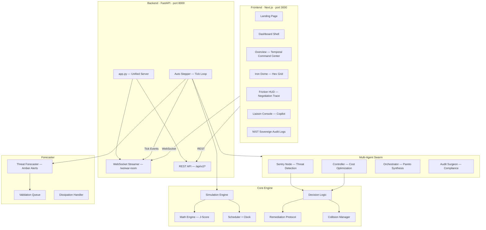
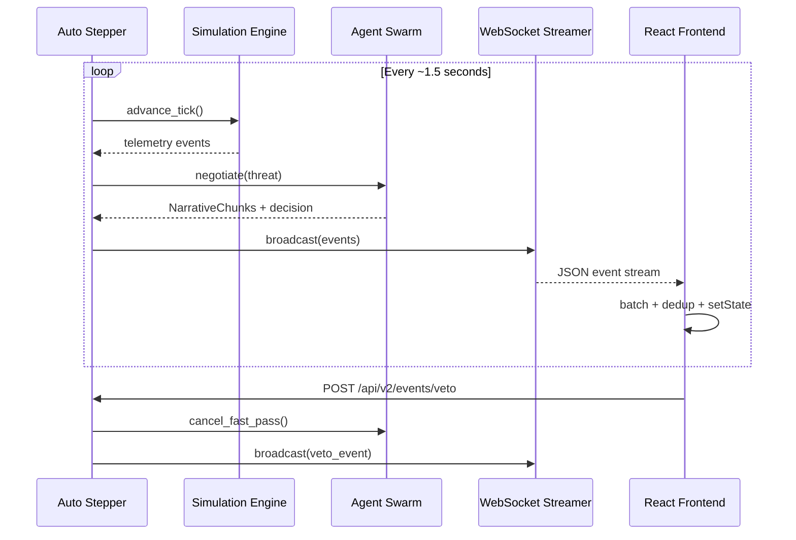

# CloudGuard — Implementation Plan

> **GenAI-Powered Autonomous Cloud Governance Platform**
> Version 0.3.0 · Last updated: April 2026

---

## Table of Contents

1. [Project Overview](#1-project-overview)
2. [Architecture](#2-architecture)
3. [Project Structure](#3-project-structure)
4. [Backend — Sovereign Engine](#4-backend--sovereign-engine)
5. [Frontend — React Dashboard](#5-frontend--react-dashboard)
6. [Data Flow](#6-data-flow)
7. [Completed Phases](#7-completed-phases)
8. [Current State](#8-current-state)
9. [Future Roadmap](#9-future-roadmap)
10. [Running the Project](#10-running-the-project)

---

## 1. Project Overview

CloudGuard is an autonomous cloud security governance platform that uses a multi-agent AI swarm to:

- **Detect** cloud misconfigurations and drift in real-time via simulated telemetry
- **Forecast** threats using a stochastic J-Score cost-risk function
- **Remediate** autonomously with a 10-second "Fast-Pass" human-override window
- **Audit** every decision through a NIST-aligned forensic black-box recorder

The system runs a continuous simulation loop where agents (Sentry, Controller, Orchestrator) negotiate remediation strategies, and a sovereign decision engine either auto-executes or defers to human veto.

---

## 2. Architecture



---

## 3. Project Structure

After cleanup, the repository contains only the files essential to the running system:

```
cloud-security-copilot/
├── cloudguard/                  # ─── BACKEND (Python/FastAPI) ───
│   ├── app.py                   # Unified FastAPI server entry point
│   ├── __init__.py
│   │
│   ├── api/                     # HTTP & WebSocket interfaces
│   │   ├── routes.py            # REST endpoints (/api/v2/*)
│   │   ├── streamer.py          # WebSocket war-room + event buffer
│   │   ├── auto_stepper.py      # Background tick loop (drives simulation)
│   │   └── narrative_engine.py  # NarrativeChunk event generation
│   │
│   ├── core/                    # Core business logic
│   │   ├── math_engine.py       # J-Score optimization
│   │   ├── decision_logic.py    # Sovereign decision: auto-execute vs defer
│   │   ├── remediation.py       # Remediation protocol execution
│   │   ├── collision_manager.py # Prevents conflicting remediations
│   │   ├── audit_reporter.py    # NIST-aligned audit report generation
│   │   ├── scheduler.py         # Task scheduling
│   │   ├── clock.py             # Temporal clock (Tick/Epoch/Cycle)
│   │   ├── schemas.py           # Pydantic data models
│   │   ├── swarm.py             # Swarm coordination logic
│   │   └── tasks.py             # Background task definitions
│   │
│   ├── agents/                  # Multi-agent swarm
│   │   ├── swarm.py             # Agent orchestration
│   │   ├── sentry_node.py       # Threat detection & assessment
│   │   └── audit_surgeon.py     # Compliance verification
│   │
│   ├── forecaster/              # Threat forecasting subsystem
│   │   ├── threat_forecaster.py # Amber Alert generation
│   │   ├── forecaster.py        # Base forecaster logic
│   │   ├── validation_queue.py  # Forecast validation
│   │   └── dissipation_handler.py
│   │
│   ├── simulation/              # Simulation engine
│   │   ├── engine.py            # Core tick loop
│   │   ├── telemetry.py         # SIEM telemetry generation
│   │   └── chaos_monkey.py      # Drift injection
│   │
│   ├── simulator/               # Advanced simulation
│   │   ├── amber_sequence_generator.py
│   │   ├── chaos_monkey.py
│   │   └── inject_drift.py
│   │
│   ├── graph/
│   │   └── state_machine.py     # Governance state machine
│   │
│   ├── infra/
│   │   ├── branch_manager.py    # State branch management
│   │   ├── memory_service.py    # H-MEM in-memory store
│   │   └── redis_bus.py         # Redis pub/sub (future)
│   │
│   └── kernel/
│       └── main.py              # Kernel entry point
│
├── src/                         # ─── FRONTEND (Next.js/React) ───
│   ├── app/
│   │   ├── layout.js            # Root layout
│   │   ├── page.js              # Landing page
│   │   ├── globals.css          # Global styles
│   │   └── dashboard/
│   │       ├── layout.js        # Dashboard shell (sidebar)
│   │       ├── page.js          # Overview route
│   │       ├── findings/page.js # Iron Dome
│   │       ├── cost/page.js     # Friction HUD
│   │       ├── copilot/page.js  # Liaison Console
│   │       ├── logs/page.js     # Audit Logs
│   │       └── settings/page.js # Settings
│   │
│   ├── components/
│   │   ├── dashboard/
│   │   │   ├── views/           # Page-level view components
│   │   │   │   ├── TemporalCommandCenter.js
│   │   │   │   ├── IronDomeView.js
│   │   │   │   ├── FrictionHudView.js
│   │   │   │   ├── LiaisonConsoleView.js
│   │   │   │   ├── SovereignAuditLogs.js
│   │   │   │   └── SettingsView.js
│   │   │   └── components/      # Reusable UI components
│   │   │       ├── MetricCard.js
│   │   │       ├── RiskItem.js
│   │   │       ├── HoneycombCell.js
│   │   │       ├── NegotiationLog.js
│   │   │       ├── AuditRow.js
│   │   │       ├── LogTerminalItem.js
│   │   │       └── SidebarItem.js
│   │   └── landing/
│   │       ├── NavBar.js
│   │       ├── FeatureCard.js
│   │       ├── PricingRow.js
│   │       └── AnimatedWorkflowPipeline.js
│   │
│   └── lib/                     # Hooks & API client
│       ├── useSovereignStream.js # WebSocket (real-time + dedup)
│       ├── useMetricData.js      # REST polling + refetch()
│       ├── useFastPassTimer.js   # Fast-Pass countdown + veto
│       └── api.js                # REST client
│
├── public/                      # Static assets
├── tests/                       # Test suite
├── .env                         # Environment variables
├── pyproject.toml               # Python config
├── requirements.txt             # Python dependencies
├── package.json                 # Node.js dependencies
├── docker-compose.yml           # Docker deployment
└── README.md                    # Documentation
```

---

## 4. Backend — Sovereign Engine

### 4.1 Entry Point

| File | Purpose |
|------|---------|
| `cloudguard/app.py` | FastAPI app with CORS, lifespan hooks, route registration |

**Run:** `uvicorn cloudguard.app:app --port 8000`

### 4.2 API Endpoints

| Endpoint | Method | Purpose |
|----------|--------|---------|
| `/ws/war-room` | WebSocket | Real-time event stream |
| `/api/v2/simulation/state` | GET | Simulation state snapshot |
| `/api/v2/simulation/step` | POST | Advance one tick |
| `/api/v2/math/j-score` | GET | Current J-Score breakdown |
| `/api/v2/math/j-history` | GET | J-Score history |
| `/api/v2/branches` | GET | State branch tree |
| `/api/v2/events/audit-report` | GET | NIST audit report |
| `/api/v2/events/metrics` | GET | Compliance metrics |
| `/api/v2/events/veto` | POST | Manual operator veto |
| `/api/v2/health` | GET | System health |
| `/docs` | GET | Swagger UI |

### 4.3 Auto Stepper (Tick Loop)

Every ~1.5 seconds, `auto_stepper.py`:
1. Advances the simulation by one tick
2. Generates SIEM telemetry (VPC flow, CloudTrail, K8s audit)
3. Runs threat forecasting → `ForecastSignal` events
4. Triggers agent negotiations → `NarrativeChunk` events
5. Executes sovereign remediations → `Remediation` events
6. Broadcasts all events to WebSocket clients

### 4.4 J-Score Function

```
J = min Σ (w_R · P · R_i + w_C · C_i)
```

| Variable | Meaning |
|----------|---------|
| `w_R` | Risk weight (Sentry preference) |
| `w_C` | Cost weight (Controller preference) |
| `P` | Probability of threat |
| `R_i` | Risk impact of resource i |
| `C_i` | Cost of remediation for resource i |

The Orchestrator uses NSGA-II multi-objective optimization to find Pareto-optimal solutions.

---

## 5. Frontend — React Dashboard

### 5.1 Design System

- **Theme**: Cyber-Obsidian — light glassmorphism, soft blues, white cards
- **Fonts**: Inter (Google Fonts)
- **Animation**: Framer Motion
- **Layout**: Sidebar (icon nav) + main content, responsive

### 5.2 Views

| View | Route | Purpose |
|------|-------|---------|
| Overview | `/dashboard` | KPI cards, risk horizon, past events, remediations |
| Iron Dome | `/dashboard/findings` | 3D hex-grid topology map |
| Friction HUD | `/dashboard/cost` | Agent negotiation + Fast-Pass countdown |
| Liaison Console | `/dashboard/copilot` | Explainability feed + J-Score + veto |
| Audit Logs | `/dashboard/logs` | NIST forensic recorder |
| Settings | `/dashboard/settings` | Configuration |

### 5.3 Data Hooks

| Hook | Type | Purpose |
|------|------|---------|
| `useSovereignStream` | WebSocket | Real-time events, 50ms batching, dedup by event_id |
| `useMetricData` | REST (5s) | Compliance metrics, J-history, manual `refetch()` |
| `useFastPassTimer` | Derived | 10s countdown from NarrativeChunk, veto via REST |

---

## 6. Data Flow



### Event Types

| Event Type | Source | Consumer |
|------------|--------|----------|
| `ForecastSignal` | Threat Forecaster | Overview, Friction HUD |
| `NarrativeChunk` | Narrative Engine | Liaison Console, Friction HUD |
| `Remediation` | Decision Logic | Overview (Remediations) |
| `TopologySync` | Simulation Engine | Iron Dome |
| `TickerUpdate` | Auto Stepper | All views |
| `SwarmCoolingDown` | Swarm | All views (backoff) |
| `BufferReplay` | Streamer | Initial hydration on connect |
| `Heartbeat` | Streamer | Keep-alive (filtered) |

---

## 7. Completed Phases

### Phase 1 — Research-Valid Foundation ✅
- SimulationEngine with tick/epoch/cycle temporal clock
- MathEngine with J-Score Pareto optimization (NSGA-II)
- StateBranchManager for state tree
- Pydantic schemas for all domain models
- SIEM telemetry generator

### Phase 2 — Multi-Agent Swarm ✅
- Sentry Node — threat detection
- Controller Agent — cost optimization
- Orchestrator — Pareto synthesis with J-Score convergence
- ChaosMonkey — drift injection
- CollisionManager — prevents conflicting remediations

### Phase 3 — War Room Streaming ✅
- WebSocket `/ws/war-room` with event buffer + replay
- Auto Stepper (1.5s tick loop)
- NarrativeEngine for explainable AI
- Ping/pong keepalive + exponential backoff reconnection

### Phase 4 — Frontend Dashboard ✅
- Landing page with feature showcase
- 6-view dashboard with sidebar navigation
- Real-time data via WebSocket with deduplication
- T-Minus Sync for manual refresh
- Interactive Fast-Pass veto system
- NIST audit report download

---

## 8. Current State

### Working ✅
- Backend on port 8000, full tick loop active
- Frontend on port 3000, live WebSocket connection
- All 6 dashboard views with real-time data
- T-Minus Sync button with manual refetch
- Past Events showing live stream data
- Forecast Horizon with Amber Alerts
- Fast-Pass countdown with functional veto
- Event deduplication (no duplicate React keys)
- NIST audit download

### Known Limitations
- In-memory state only (no persistence across restarts)
- `auto_stepper.py` sensitive to `--reload` flag
- H-MEM memory service is in-memory only
- No authentication/authorization
- Agent "AI" is rule-based, not connected to real LLM

---

## 9. Future Roadmap

### Phase 5 — Production Hardening
| Task | Priority | Description |
|------|----------|-------------|
| Redis Pub/Sub | High | Replace in-memory bus for multi-instance |
| PostgreSQL | High | Persist state, audit logs, J-Score history |
| JWT Auth | High | Role-based access (Operator / CISO / Viewer) |
| Rate limiting | Medium | Protect REST endpoints |
| Prometheus | Medium | Metrics + Grafana dashboards |

### Phase 6 — Real Cloud Integration
| Task | Priority | Description |
|------|----------|-------------|
| AWS connector | High | EC2, S3, IAM, SecurityHub |
| Azure connector | Medium | Azure Policy + Defender |
| GCP connector | Medium | Security Command Center |
| Terraform state | Medium | Real drift detection |

### Phase 7 — LLM Integration
| Task | Priority | Description |
|------|----------|-------------|
| Gemini/GPT | High | Replace rule-based narratives with LLM |
| RAG pipeline | Medium | Ingest NIST, CIS, SOC2 frameworks |
| NL veto | Low | LLM-validated operator veto reasons |

### Phase 8 — Threat Horizon Overlay
| Task | Priority | Description |
|------|----------|-------------|
| Predictive map | Medium | Overlay threat probabilities on Iron Dome |
| Attack paths | Medium | Predicted lateral movement |
| Historical replay | Low | Scrub through past states |

---

## 10. Running the Project

### Prerequisites
- Python 3.11+
- Node.js 18+

### Backend
```bash
pip install -r requirements.txt
uvicorn cloudguard.app:app --port 8000
```

> [!WARNING]
> Do NOT use `--reload` — it causes duplicate auto_stepper background tasks.

### Frontend
```bash
npm install
npm run dev
```

### Environment (`.env`)
```
NEXT_PUBLIC_API_URL=http://localhost:8000
NEXT_PUBLIC_WS_URL=ws://localhost:8000/ws/war-room
```

### Docker
```bash
docker-compose up --build
```
